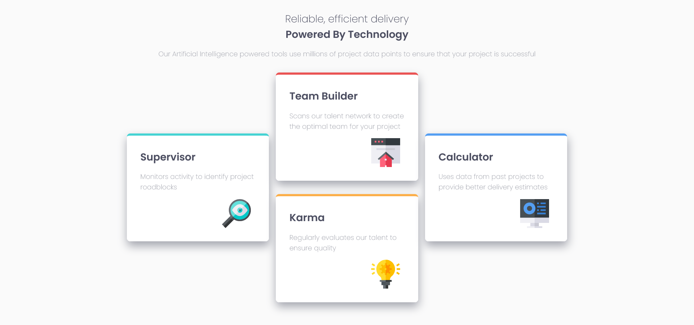

# Frontend Mentor - Four card feature section solution

This is a solution to the [Four card feature section challenge on Frontend Mentor](https://www.frontendmentor.io/challenges/four-card-feature-section-weK1eFYK). Frontend Mentor challenges help you improve your coding skills by building realistic projects. 

## Table of contents

- [Overview](#overview)
  - [The challenge](#the-challenge)
  - [Screenshot](#screenshot)
  - [Links](#links)
- [My process](#my-process)
  - [Built with](#built-with)
  - [What I learned](#what-i-learned)
  - [Continued development](#continued-development)
  - [Useful resources](#useful-resources)
- [Author](#author)
- [Acknowledgments](#acknowledgments)

**Note: Delete this note and update the table of contents based on what sections you keep.**

## Overview

### The challenge

Users should be able to:

- View the optimal layout for the site depending on their device's screen size

### Screenshot

## My process

### Built with

- Semantic HTML5 markup
- CSS custom properties
- Flexbox
- Mobile-first workflow

### What I learned

This was the first time I used a Mobile-first workflow and found it to be much easier to get the layout to be more responsive and fluid. There seemed to be less code that needed to be written, 
his note and the content within this section and replace with your own learnings.**

### Continued development

I plan on continuing to usee [Frontend Mentor](https://frontendmentor.io) to work on more responsive layouts to continue enhancing my CSS skills to be able to create and use my own custom CSS for projects instead of frameworks.

### Useful resources

- [CSS Tricks](https://css-tricks.com/snippets/css/a-guide-to-flexbox/) - This site is a great help with CSS in general. I used this to get most of the details with Flexbox, the basic understanding and properties of flex.

## Author

- Website - [Andre Dean](https:/andre-dean.now.sh)
